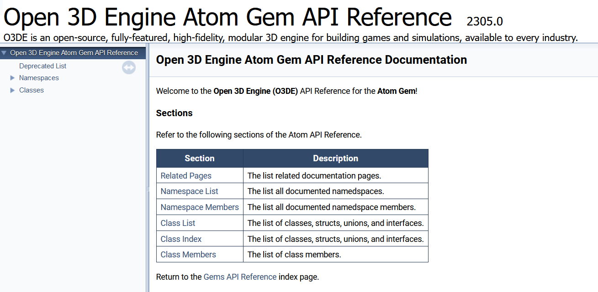
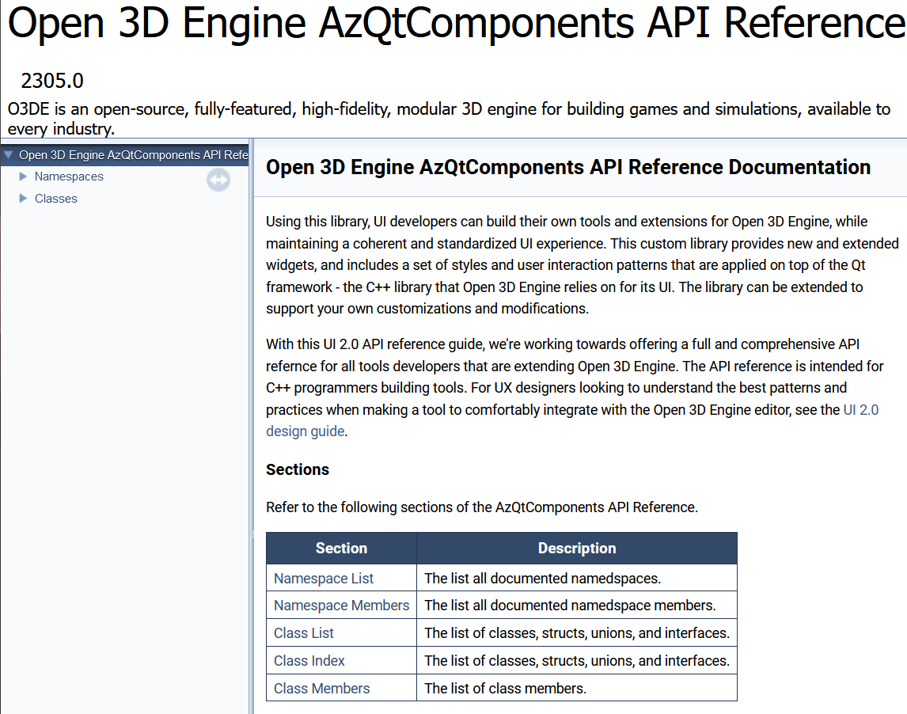

# C++ API Reference Generation

The [Open 3D Engine (O3DE) API Reference](https://www.o3de.org/docs/api/) is generated using [Doxygen](https://www.doxygen.nl/). With the help of the API Reference Generation (`o3de-doxygen`) scripts to automate the process, an API reference is generated for all frameworks and Gems in the [`o3de` repository](https://github.com/o3de/o3de) by default.  You may also configure the scripts to [generate API references for Gems in other O3DE repositories](#generating-for-gems-outside-of-o3de).


## Requirements

* Linux machine or Windows Subsystem for Linux (WSL)
* Clone of the `o3de` repository in your machine
* Clone of the `api.o3de.org` repository in your machine
* [Doxygen](https://www.doxygen.nl/manual/install.html) installation

## Set up 

### Download `o3de-doxygen`

1. Clone the  [`sig-docs-community` repository](https://github.com/o3de/sig-docs-community/), which contains the `o3de-doxygen` scripts.
2. In the `tools` directory, find the `o3de-doxygen` scripts.


### Clean repos

The C++ API reference generation scripts run Doxygen on your local `o3de` clone. These scripts output the generated files into your local `o3de.org` clone. Therefore, before you generate the API, you must ensure that your cloned repos are clean and have the latest changes.

#### o3de and o3de-extras

1. In your local `o3de` clone, `git checkout` the latest updates in the `development` branch, or in the case of a major O3DE release, the `stabilization` branch. 

    ```shell
    git fetch --all
    git checkout upstream/<branch> 
    ```
   -  **upstream**: Set to track the source repos
      -  o3de - [`https://github.com/o3de/o3de.git`](https://github.com/o3de/o3de.git)
      -  o3de-extras - [`https://github.com/o3de/o3de-extras.git`](https://github.com/o3de/o3de-extras.git)

2. Make sure the branch is clean from any untracked files or changes. The branch should be at the same state as the upstream branch's HEAD. To clean, run  `git clean`, `git reset`, or `git stash` as needed.

3. Repeat these steps with `o3de-extras`.

#### api.o3de.org

1. In your local `api.o3de.org` clone, `git checkout` the latest updates in the `development` branch, or in the case of a major O3DE release, the `stabilization` branch. 

    ```shell
    git fetch --all
    git checkout upstream/<branch> 
    ```
   -  **upstream**: Set to track the source repo, [`https://github.com/o3de/api.o3de.org.git`](https://github.com/o3de/api.o3de.org.git)

1. Create a new branch, such as `api-ref`. This branch will contain the API reference docs that you will [generate](#generate) in a later step.

    ```shell
    git switch -c api-ref
    ```

1. Make sure the branch is clean from any untracked files or changes. The branch should be at the same state as the upstream branch's HEAD. To clean, run  `git clean`, `git reset`, or `git stash` as needed.

### Prepare scripts

1. Edit `config.sh` in the `o3de-doxygen` directory and set the following variables:

   - `O3DE_PATH`: Path to your local o3de clone  (e.g. `O3DE_PATH=$HOME/o3de`)

   - `O3DEORG_PATH`: Path to your local api.o3de.org clone (e.g. `O3DEORG_PATH=$HOME/api.o3de.org`)
   
   - `PROJECT_NUMBER`: The O3DE version of this API reference  (e.g. `PROJECT_NUMBER=23.05.0`)

    The C++ API reference generation scripts read from `O3DE_PATH` and write to `O3DEORG_PATH`. 

2. If this is your first time running the script, you may need to enable permissions to execute the program. In the `o3de-doxygen` directory, run the following: 

```shell
cd <path-to>/o3de-doxygen
chmod +x *.sh
```

## Generate

The following scripts generate the frameworks and Gems APIs. 

### Frameworks API

In the `o3de-doxygen` directory, run the script:

```shell
./o3de-framework-apis.sh
```

This generates the following files in `O3DEORG_PATH`: 
 - `content/frameworks/_index.md`
 - `frameworks/*`

### Gems API

In the `o3de-doxygen` directory, run the script:

```shell
./o3de-gem-apis.sh
```

This generates the following files in `O3DEORG_PATH`: 
  - `content/gems/_index.md`
  - `gems/*`

## Generating for Gems outside of `o3de`

In some cases, the O3DE API Reference must include the API for code that lives outside of the `o3de` repository. This is typically decided by O3DE members and the Release Special Interest Group (SIG). For example, a major O3DE release may include new Gems that live in the `o3de-extras` repository.

To generate API References for Gems outside of `o3de`: 

1. Move or copy the Gem's directory into the `Gems` directory of your local `o3de` clone. 

    To do this using the terminal in your Linux machine, run the following `cp` command with your specified paths. This copies the Gem into the `o3de/Gems/` directory.

    ```shell
    cp -r <path-to-gem> <path-to>/o3de/Gems
    ```

2. [Generate the Gems API](#gems-api). 

## Publish

After generating the C++ API reference and supplemental files, it's time to publish them on the website. When you [cleaned your `api.o3de.org` clone](#o3deorg), you set up a new clean branch, such as `api-ref`, and when you [generated](#generate) the APIs, the files were placed in that branch. 

To publish the newly generated APIs, you must run `git add`, `git commit`, `git push`, and create a new pull request. For guidance through each step, please refer to the [O3DE Docs Contributions: Runbook](https://www.o3de.org/docs/contributing/to-docs/git-workflow/).

### Update `o3de.org`

#### Automatic Update (**Recommended**)

Once the API docs are merged on GitHub, Hugo needs to know about the new version. In the `o3de.org` repo, check out and clean the corresponding branch (stabilization, development, main, etc.). Then, run `hugo mod get -u github.com/o3de/api.o3de.org`. The version reference in `go.mod` should now point to the SHA of the commit to `api.o3de.org`.

#### Manual Update (**Not Recommended**)

> [!CAUTION]
> Due to the risk of errors, this method should only be used when absolutely necessary. Future improvements will automate this process and remove the need for manual intervention entirely.

If the main branch `api.o3de.org` has been updated beyond the version you need, it is possible to update the `go.mod` reference by hand, matching the existing format for the version. The first half of the version string is the commit date and time (`HHmmss`) in UTC, and the second half is the first 12 characters of the commit SHA. After saving the file, delete the `go.sum` file, if it exists, and run `hugo mod get` to make Hugo resync its data. Verify the update, then commit, push, and create or update the PR as needed.


## Customizing the API's main page

The main page is the first page you see when you open a framework or Gem's Doxygen-generated API reference. For example, open any [framework](https://www.o3de.org/docs/api/frameworks/) or [Gem](https://www.o3de.org/docs/api/gems/) in the API docs. The contents of the main page is either automatically generated, or specified by the developer by using the Doxygen command, [\mainpage](https://doxygen.nl/manual/commands.html#cmdmainpage), in the code's comments.

By default, if `\mainpage` is not specified, an API's main page includes a brief introduction and a table of contents, like the following: 



If a developer documents the API using `\mainpage`, it will replace the default introduction. However, you may still insert the table of contents by adding `o3de-doxygen-insert-table` to your `\mainpage` comment block. For example, this comment block in the AzQtComponents's source code generates the following main page. 

```
/**
 * \mainpage
 * 
 * Using this library, UI developers can build their own tools and
 * extensions for Open 3D Engine, while maintaining a coherent and standardized UI experience.
 * This custom library provides new and extended widgets, and includes a set of styles and
 * user interaction patterns that are applied on top of the Qt framework - the C++ library
 * that Open 3D Engine relies on for its UI. The library can be extended to support your own customizations and modifications. 
 * 
 * With this UI 2.0 API reference guide, we're working towards offering a full and comprehensive
 * API reference for all tools developers that are extending Open 3D Engine. The API reference
 * is intended for C++ programmers building tools. For UX designers looking to understand
 * the best patterns and practices when making a tool to comfortably integrate with
 * the Open 3D Engine editor, see the [UI 2.0 design guide](https://o3de.org/docs/tools-ui/ui-dev-intro/).
 * 
 * o3de-doxygen-insert-table
 * 
 */
```

